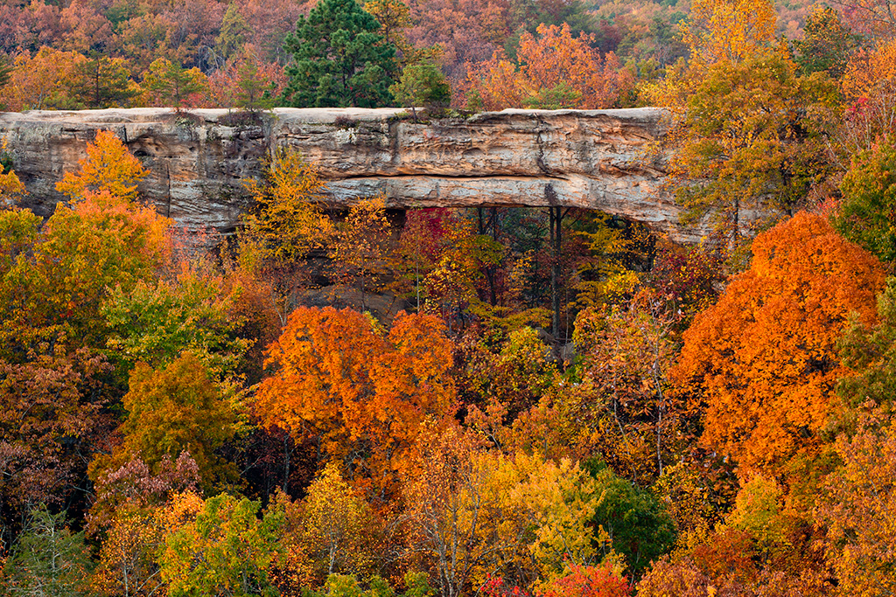

<!-- Heading 1 -->
# Welcome to the Red River Gorge 

<!-- First paragraph -->
Welcome to my page about Red River Gorge located in Eastern Kentucky.

<!-- Heading 2 -->
## Facts about Red River Gorge:

<!-- Ordered list -->
1. Red River Gorge could have been turned into a lake, but was saved by a protest hike.
2.  Red River Gorge is registered as a National Natural Landmark.

<!-- Link to web page -->
[Map of Red River Gorge](https://www.fs.usda.gov/Internet/FSE_DOCUMENTS/stelprdb5288706.pdf)

<!-- Display PNG image from a different server. Notice the exclamation mark ! -->
    
Source: ...

<!-- 
    This is a comment. The above line grabs a PNG from a URL and will display it as an image. The "Become Happy" text inside the brackets is called an Alt property and is used in case the image is corrupted or for browsers that don't display images (they exist). 
-->

<!-- Heading 3 -->
### Sources
1. Https://roadsriversandtrails.com/rrt_adventures/10-things-you-didnt-know-about-red-river-gorge/
2. Https://www.fs.usda.gov/Internet/FSE_DOCUMENTS/stelprdb5288706.pdf
3. Https://cabinsofbirchhollow.com/tag/canoeing-in-red-river-gorge/

Hayden Dickens, February, 2019
